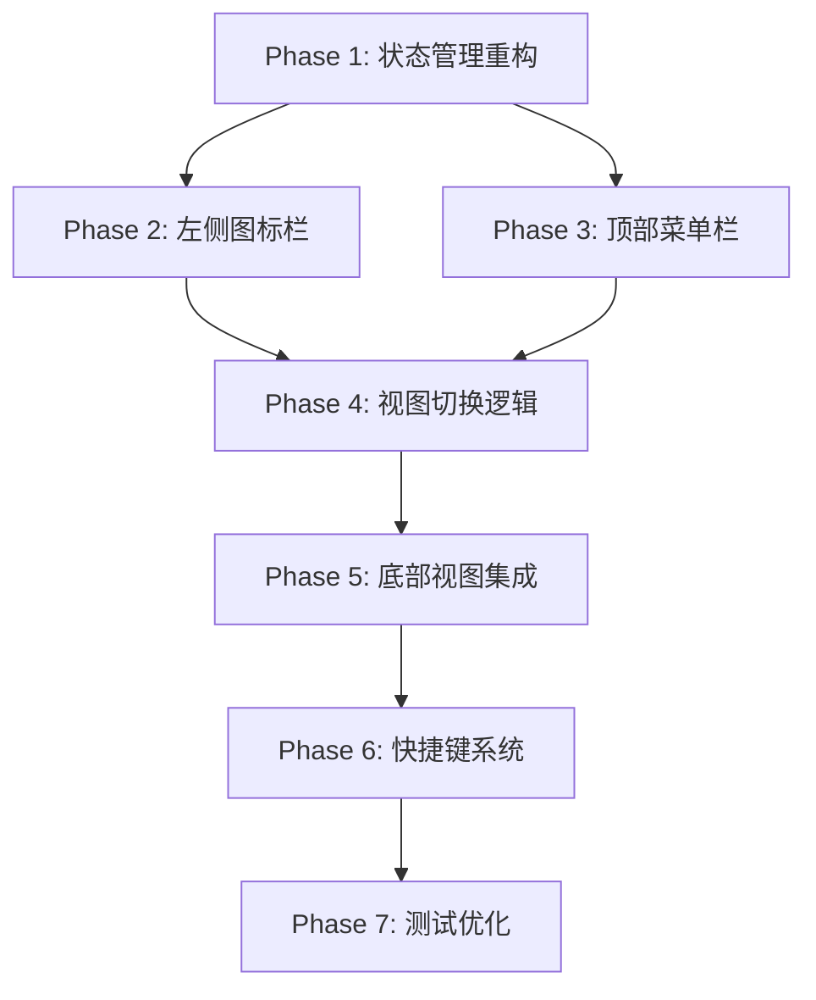

# Bkdmm 工作区视图重构 - 执行工作流

## 工作流总览



---

## Phase 1: 状态管理重构

### 任务清单
- [ ] 创建 `LayoutState` 模型
- [ ] 创建 `ViewConfig` 模型
- [ ] 创建 `LayoutProvider` 状态管理
- [ ] 定义视图配置常量

### 实现步骤

#### Step 1.1: 创建模型文件

**文件:** `lib/features/workspace/models/layout_state.dart`

```dart
import 'package:flutter/material.dart';
import 'view_config.dart';

/// 布局状态
class LayoutState {
  // ========== 左侧视图 ==========
  /// 当前激活的左侧视图ID
  final String? activeLeftView;

  /// 左侧视图可见性映射
  final Map<String, bool> leftViewVisibility;

  /// 左侧视图宽度
  final double leftViewWidth;

  // ========== 右侧视图 ==========
  /// 右侧视图是否可见
  final bool rightViewVisible;

  /// 右侧视图宽度
  final double rightViewWidth;

  // ========== 底部视图 ==========
  /// 当前激活的底部视图ID
  final String? activeBottomView;

  /// 底部视图可见性映射
  final Map<String, bool> bottomViewVisibility;

  /// 底部视图高度
  final double bottomViewHeight;

  // ========== 图标栏 ==========
  /// 图标栏宽度
  final double iconBarWidth;

  // ========== 视图配置 ==========
  /// 左侧视图配置列表
  final List<ViewConfig> leftViewConfigs;

  /// 底部视图配置列表
  final List<ViewConfig> bottomViewConfigs;

  const LayoutState({
    this.activeLeftView,
    this.leftViewVisibility = const {},
    this.leftViewWidth = 260,
    this.rightViewVisible = true,
    this.rightViewWidth = 280,
    this.activeBottomView,
    this.bottomViewVisibility = const {},
    this.bottomViewHeight = 200,
    this.iconBarWidth = 48,
    this.leftViewConfigs = const [],
    this.bottomViewConfigs = const [],
  });

  /// 检查左侧视图是否可见
  bool isLeftViewVisible(String viewId) {
    return activeLeftView == viewId && (leftViewVisibility[viewId] ?? false);
  }

  /// 检查底部视图是否可见
  bool isBottomViewVisible(String viewId) {
    return activeBottomView == viewId && (bottomViewVisibility[viewId] ?? false);
  }

  LayoutState copyWith({
    String? activeLeftView,
    Map<String, bool>? leftViewVisibility,
    double? leftViewWidth,
    bool? rightViewVisible,
    double? rightViewWidth,
    String? activeBottomView,
    Map<String, bool>? bottomViewVisibility,
    double? bottomViewHeight,
    double? iconBarWidth,
    List<ViewConfig>? leftViewConfigs,
    List<ViewConfig>? bottomViewConfigs,
  }) {
    return LayoutState(
      activeLeftView: activeLeftView ?? this.activeLeftView,
      leftViewVisibility: leftViewVisibility ?? this.leftViewVisibility,
      leftViewWidth: leftViewWidth ?? this.leftViewWidth,
      rightViewVisible: rightViewVisible ?? this.rightViewVisible,
      rightViewWidth: rightViewWidth ?? this.rightViewWidth,
      activeBottomView: activeBottomView ?? this.activeBottomView,
      bottomViewVisibility: bottomViewVisibility ?? this.bottomViewVisibility,
      bottomViewHeight: bottomViewHeight ?? this.bottomViewHeight,
      iconBarWidth: iconBarWidth ?? this.iconBarWidth,
      leftViewConfigs: leftViewConfigs ?? this.leftViewConfigs,
      bottomViewConfigs: bottomViewConfigs ?? this.bottomViewConfigs,
    );
  }
}
```

---

**文件:** `lib/features/workspace/models/view_config.dart`

```dart
import 'package:flutter/material.dart';

/// 视图位置
enum ViewPosition {
  left,    // 左侧视图
  right,   // 右侧视图
  bottom,  // 底部视图
}

/// 视图配置
class ViewConfig {
  /// 视图ID
  final String id;

  /// 视图标题
  final String title;

  /// 图标
  final IconData icon;

  /// 快捷键
  final String shortcut;

  /// 视图位置
  final ViewPosition position;

  /// 默认是否可见
  final bool isDefaultVisible;

  /// 默认宽度
  final double defaultWidth;

  /// 默认高度
  final double defaultHeight;

  /// 排序顺序
  final int order;

  const ViewConfig({
    required this.id,
    required this.title,
    required this.icon,
    required this.shortcut,
    required this.position,
    this.isDefaultVisible = true,
    this.defaultWidth = 260,
    this.defaultHeight = 200,
    this.order = 0,
  });
}
```

---

#### Step 1.2: 创建状态管理

**文件:** `lib/features/workspace/providers/layout_provider.dart`

```dart
import 'package:flutter_riverpod/flutter_riverpod.dart';
import '../models/layout_state.dart';
import '../models/view_config.dart';
import '../constants/view_configs.dart';

/// 布局状态 Provider
final layoutProvider = StateNotifierProvider<LayoutNotifier, LayoutState>(
  (ref) => LayoutNotifier(),
);

/// 布局状态管理器
class LayoutNotifier extends StateNotifier<LayoutState> {
  LayoutNotifier() : super(LayoutState(
    leftViewConfigs: ViewConfigs.leftViews,
    bottomViewConfigs: ViewConfigs.bottomViews,
    leftViewVisibility: ViewConfigs.defaultLeftVisibility,
    bottomViewVisibility: ViewConfigs.defaultBottomVisibility,
    activeLeftView: 'module_tree', // 默认激活模块树
  ));

  // ========== 左侧视图操作 ==========

  /// 显示左侧视图
  void showLeftView(String viewId) {
    state = state.copyWith(
      activeLeftView: viewId,
      leftViewVisibility: {
        ...state.leftViewVisibility,
        viewId: true,
      },
    );
  }

  /// 隐藏左侧视图
  void hideLeftView() {
    state = state.copyWith(
      activeLeftView: null,
    );
  }

  /// 切换左侧视图
  void toggleLeftView(String viewId) {
    if (state.activeLeftView == viewId) {
      hideLeftView();
    } else {
      showLeftView(viewId);
    }
  }

  /// 设置左侧视图宽度
  void setLeftViewWidth(double width) {
    state = state.copyWith(leftViewWidth: width.clamp(200, 400));
  }

  // ========== 右侧视图操作 ==========

  /// 显示右侧视图
  void showRightView() {
    state = state.copyWith(rightViewVisible: true);
  }

  /// 隐藏右侧视图
  void hideRightView() {
    state = state.copyWith(rightViewVisible: false);
  }

  /// 切换右侧视图
  void toggleRightView() {
    state = state.copyWith(rightViewVisible: !state.rightViewVisible);
  }

  /// 设置右侧视图宽度
  void setRightViewWidth(double width) {
    state = state.copyWith(rightViewWidth: width.clamp(200, 400));
  }

  // ========== 底部视图操作 ==========

  /// 显示底部视图
  void showBottomView(String viewId) {
    state = state.copyWith(
      activeBottomView: viewId,
      bottomViewVisibility: {
        ...state.bottomViewVisibility,
        viewId: true,
      },
    );
  }

  /// 隐藏底部视图
  void hideBottomView() {
    state = state.copyWith(activeBottomView: null);
  }

  /// 切换底部视图
  void toggleBottomView(String viewId) {
    if (state.activeBottomView == viewId) {
      hideBottomView();
    } else {
      showBottomView(viewId);
    }
  }

  /// 设置底部视图高度
  void setBottomViewHeight(double height) {
    state = state.copyWith(bottomViewHeight: height.clamp(100, 400));
  }

  // ========== 全局操作 ==========

  /// 隐藏所有视图
  void hideAllViews() {
    state = state.copyWith(
      activeLeftView: null,
      rightViewVisible: false,
      activeBottomView: null,
    );
  }

  /// 恢复默认布局
  void restoreDefaultLayout() {
    state = LayoutState(
      leftViewConfigs: ViewConfigs.leftViews,
      bottomViewConfigs: ViewConfigs.bottomViews,
      leftViewVisibility: ViewConfigs.defaultLeftVisibility,
      bottomViewVisibility: ViewConfigs.defaultBottomVisibility,
      activeLeftView: 'module_tree',
      rightViewVisible: true,
    );
  }
}
```

---

#### Step 1.3: 定义视图配置常量

**文件:** `lib/features/workspace/constants/view_configs.dart`

```dart
import 'package:tdesign_flutter/tdesign_flutter.dart';
import '../models/view_config.dart';

/// 视图配置常量
class ViewConfigs {
  ViewConfigs._();

  // ========== 左侧视图配置 ==========
  static const List<ViewConfig> leftViews = [
    ViewConfig(
      id: 'module_tree',
      title: '模块树',
      icon: TDIcons.view_module,
      shortcut: 'Alt+1',
      position: ViewPosition.left,
      isDefaultVisible: true,
      defaultWidth: 260,
      order: 1,
    ),
    ViewConfig(
      id: 'datatype',
      title: '数据类型',
      icon: TDIcons.code,
      shortcut: 'Alt+D',
      position: ViewPosition.left,
      isDefaultVisible: false,
      defaultWidth: 260,
      order: 2,
    ),
  ];

  // ========== 底部视图配置 ==========
  static const List<ViewConfig> bottomViews = [
    ViewConfig(
      id: 'console',
      title: '控制台',
      icon: TDIcons.terminal,
      shortcut: 'Alt+C',
      position: ViewPosition.bottom,
      isDefaultVisible: false,
      defaultHeight: 200,
      order: 1,
    ),
    ViewConfig(
      id: 'log',
      title: '日志',
      icon: TDIcons.file_text,
      shortcut: 'Alt+L',
      position: ViewPosition.bottom,
      isDefaultVisible: false,
      defaultHeight: 200,
      order: 2,
    ),
    ViewConfig(
      id: 'output',
      title: '输出',
      icon: TDIcons.code,
      shortcut: 'Alt+O',
      position: ViewPosition.bottom,
      isDefaultVisible: false,
      defaultHeight: 200,
      order: 3,
    ),
  ];

  // ========== 默认可见性 ==========
  static Map<String, bool> get defaultLeftVisibility =>
      {for (var v in leftViews) v.id: v.isDefaultVisible};

  static Map<String, bool> get defaultBottomVisibility =>
      {for (var v in bottomViews) v.id: v.isDefaultVisible};

  // ========== 快捷键映射 ==========
  static const Map<String, String> shortcutToViewId = {
    'Alt+1': 'module_tree',
    'Alt+D': 'datatype',
    'Alt+P': 'properties',
    'Alt+C': 'console',
    'Alt+L': 'log',
    'Alt+O': 'output',
  };
}
```

---

## Phase 2: 左侧图标栏实现

### 任务清单
- [ ] 创建 `IconBar` 主组件
- [ ] 创建 `IconButton` 组件
- [ ] 创建 `UpperSection` 上部区域
- [ ] 创建 `LowerSection` 下部区域

### 实现步骤

#### Step 2.1: 创建图标栏主组件

**文件:** `lib/features/workspace/widgets/icon_bar/icon_bar.dart`

```dart
import 'package:flutter/material.dart';
import 'package:flutter_riverpod/flutter_riverpod.dart';
import 'package:tdesign_flutter/tdesign_flutter.dart';
import '../../providers/layout_provider.dart';
import 'upper_section.dart';
import 'lower_section.dart';

/// 左侧图标栏
class IconBar extends ConsumerWidget {
  const IconBar({super.key});

  @override
  Widget build(BuildContext context, WidgetRef ref) {
    final tdTheme = TDTheme.of(context);
    final layoutState = ref.watch(layoutProvider);

    return Container(
      width: layoutState.iconBarWidth,
      color: tdTheme.bgColorContainer,
      child: Column(
        children: [
          // 上部图标区 - 控制左侧视图
          Expanded(
            child: UpperSection(
              views: layoutState.leftViewConfigs,
              activeViewId: layoutState.activeLeftView,
              onViewToggle: (viewId) =>
                  ref.read(layoutProvider.notifier).toggleLeftView(viewId),
            ),
          ),

          // 分割线
          Container(
            height: 1,
            margin: const EdgeInsets.symmetric(vertical: 8),
            color: tdTheme.componentBorderColor,
          ),

          // 下部图标区 - 控制底部视图
          LowerSection(
            views: layoutState.bottomViewConfigs,
            activeViewId: layoutState.activeBottomView,
            onViewToggle: (viewId) =>
                ref.read(layoutProvider.notifier).toggleBottomView(viewId),
          ),
        ],
      ),
    );
  }
}
```

---

#### Step 2.2: 创建图标按钮组件

**文件:** `lib/features/workspace/widgets/icon_bar/icon_button.dart`

```dart
import 'package:flutter/material.dart';
import 'package:tdesign_flutter/tdesign_flutter.dart';
import '../../models/view_config.dart';

/// 图标栏按钮
class IconBarButton extends StatelessWidget {
  final ViewConfig config;
  final bool isActive;
  final VoidCallback onTap;

  const IconBarButton({
    super.key,
    required this.config,
    required this.isActive,
    required this.onTap,
  });

  @override
  Widget build(BuildContext context) {
    final tdTheme = TDTheme.of(context);

    return Tooltip(
      message: '${config.title} (${config.shortcut})',
      preferBelow: false,
      child: InkWell(
        onTap: onTap,
        child: Container(
          width: 48,
          height: 48,
          decoration: BoxDecoration(
            color: isActive
                ? tdTheme.brandLightColor
                : Colors.transparent,
            border: isActive
                ? Border(
                    left: BorderSide(
                      color: tdTheme.brandNormalColor,
                      width: 3,
                    ),
                  )
                : null,
          ),
          child: Column(
            mainAxisAlignment: MainAxisAlignment.center,
            children: [
              // 图标
              Icon(
                config.icon,
                size: 22,
                color: isActive
                    ? tdTheme.brandNormalColor
                    : tdTheme.textColorSecondary,
              ),
              const SizedBox(height: 2),
              // 快捷键徽章
              if (config.shortcut.contains('Alt+'))
                Text(
                  config.shortcut.replaceAll('Alt+', ''),
                  style: TextStyle(
                    fontSize: 10,
                    color: isActive
                        ? tdTheme.brandNormalColor
                        : tdTheme.textColorSecondary,
                  ),
                ),
            ],
          ),
        ),
      ),
    );
  }
}
```

---

#### Step 2.3: 创建上部区域组件

**文件:** `lib/features/workspace/widgets/icon_bar/upper_section.dart`

```dart
import 'package:flutter/material.dart';
import '../../models/view_config.dart';
import 'icon_button.dart';

/// 图标栏上部区域 - 控制左侧视图
class UpperSection extends StatelessWidget {
  final List<ViewConfig> views;
  final String? activeViewId;
  final ValueChanged<String> onViewToggle;

  const UpperSection({
    super.key,
    required this.views,
    required this.activeViewId,
    required this.onViewToggle,
  });

  @override
  Widget build(BuildContext context) {
    // 按排序顺序排列
    final sortedViews = List<ViewConfig>.from(views)
      ..sort((a, b) => a.order.compareTo(b.order));

    return SingleChildScrollView(
      child: Column(
        children: sortedViews.map((view) =>
          IconBarButton(
            config: view,
            isActive: activeViewId == view.id,
            onTap: () => onViewToggle(view.id),
          ),
        ).toList(),
      ),
    );
  }
}
```

---

#### Step 2.4: 创建下部区域组件

**文件:** `lib/features/workspace/widgets/icon_bar/lower_section.dart`

```dart
import 'package:flutter/material.dart';
import '../../models/view_config.dart';
import 'icon_button.dart';

/// 图标栏下部区域 - 控制底部视图
class LowerSection extends StatelessWidget {
  final List<ViewConfig> views;
  final String? activeViewId;
  final ValueChanged<String> onViewToggle;

  const LowerSection({
    super.key,
    required this.views,
    required this.activeViewId,
    required this.onViewToggle,
  });

  @override
  Widget build(BuildContext context) {
    // 按排序顺序排列
    final sortedViews = List<ViewConfig>.from(views)
      ..sort((a, b) => a.order.compareTo(b.order));

    return Column(
      children: sortedViews.map((view) =>
        IconBarButton(
          config: view,
          isActive: activeViewId == view.id,
          onTap: () => onViewToggle(view.id),
        ),
      ).toList(),
    );
  }
}
```

---

## Phase 3: 顶部菜单栏实现

### 任务清单
- [ ] 创建 `TopMenuBar` 主组件
- [ ] 创建 `FileMenuButton` 文件管理菜单
- [ ] 创建 `ViewMenuButton` 视图管理菜单

### 实现步骤

#### Step 3.1: 创建顶部菜单栏

**文件:** `lib/features/workspace/widgets/toolbar/top_menu_bar.dart`

```dart
import 'package:flutter/material.dart';
import 'package:flutter_riverpod/flutter_riverpod.dart';
import 'package:tdesign_flutter/tdesign_flutter.dart';
import '../../../shared/providers/providers.dart';
import '../../providers/layout_provider.dart';
import 'file_menu.dart';
import 'view_menu.dart';

/// 顶部菜单栏
class TopMenuBar extends ConsumerWidget {
  const TopMenuBar({super.key});

  @override
  Widget build(BuildContext context, WidgetRef ref) {
    final tdTheme = TDTheme.of(context);
    final projectState = ref.watch(projectProvider);
    final project = projectState.project;

    return Container(
      height: 40,
      decoration: BoxDecoration(
        color: tdTheme.bgColorContainer,
        border: Border(
          bottom: BorderSide(color: tdTheme.componentBorderColor),
        ),
      ),
      child: Row(
        children: [
          // 文件管理菜单
          const FileMenuButton(),
          const SizedBox(width: 4),

          // 视图管理菜单
          const ViewMenuButton(),
          const SizedBox(width: 8),

          // 分隔线
          Container(
            width: 1,
            height: 24,
            color: tdTheme.componentBorderColor,
          ),
          const SizedBox(width: 8),

          // 项目名称
          if (project != null) ...[
            Icon(TDIcons.folder_open, size: 18, color: tdTheme.brandNormalColor),
            const SizedBox(width: 4),
            TDText(
              project.name,
              font: tdTheme.fontBodyMedium,
              fontWeight: FontWeight.w600,
            ),
            if (projectState.isDirty)
              TDText(
                ' *',
                font: tdTheme.fontBodyMedium,
                textColor: tdTheme.brandNormalColor,
              ),
            const SizedBox(width: 8),
          ],

          const Spacer(),

          // 右侧操作按钮
          TDButton(
            icon: TDIcons.save,
            size: TDButtonSize.small,
            type: TDButtonType.text,
            theme: TDButtonTheme.defaultTheme,
            onTap: () => _saveProject(ref),
          ),
          TDButton(
            icon: TDIcons.code,
            size: TDButtonSize.small,
            type: TDButtonType.text,
            theme: TDButtonTheme.defaultTheme,
            onTap: () => _showGenerateMenu(context),
          ),
          TDButton(
            icon: TDIcons.setting,
            size: TDButtonSize.small,
            type: TDButtonType.text,
            theme: TDButtonTheme.defaultTheme,
            onTap: () => _openSettings(ref),
          ),
        ],
      ),
    );
  }

  Future<void> _saveProject(WidgetRef ref) async {
    await ref.read(projectProvider.notifier).saveProject();
  }

  void _showGenerateMenu(BuildContext context) {
    // TODO: 显示代码生成菜单
  }

  void _openSettings(WidgetRef ref) {
    // TODO: 打开设置
  }
}
```

---

#### Step 3.2: 创建文件管理菜单

**文件:** `lib/features/workspace/widgets/toolbar/file_menu.dart`

```dart
import 'package:flutter/material.dart';
import 'package:flutter_riverpod/flutter_riverpod.dart';
import 'package:tdesign_flutter/tdesign_flutter.dart';
import '../../../shared/providers/providers.dart';

/// 文件管理菜单按钮
class FileMenuButton extends ConsumerWidget {
  const FileMenuButton({super.key});

  @override
  Widget build(BuildContext context, WidgetRef ref) {
    final tdTheme = TDTheme.of(context);

    return TDPopupMenuButton(
      icon: TDIcons.folder,
      iconColor: tdTheme.textColorPrimary,
      items: [
        TDPopupMenuItem(
          value: 'new_project',
          icon: TDIcons.add,
          label: '新建项目',
        ),
        TDPopupMenuItem(
          value: 'open_project',
          icon: TDIcons.folder_open,
          label: '打开项目',
        ),
        TDPopupMenuItem(
          value: 'open_recent',
          icon: TDIcons.history,
          label: '打开最近项目...',
        ),
        const TDPopupMenuItem.divider(),
        TDPopupMenuItem(
          value: 'save',
          icon: TDIcons.save,
          label: '保存项目',
          trailing: TDText('Ctrl+S', font: tdTheme.fontMarkExtraSmall),
        ),
        TDPopupMenuItem(
          value: 'save_as',
          icon: TDIcons.folder,
          label: '另存为...',
        ),
        const TDPopupMenuItem.divider(),
        TDPopupMenuItem(
          value: 'project_settings',
          icon: TDIcons.setting,
          label: '项目设置',
        ),
        const TDPopupMenuItem.divider(),
        TDPopupMenuItem(
          value: 'close_project',
          icon: TDIcons.close,
          label: '关闭项目',
        ),
      ],
      onSelected: (value) => _handleMenuAction(context, ref, value),
    );
  }

  void _handleMenuAction(BuildContext context, WidgetRef ref, String value) {
    switch (value) {
      case 'new_project':
        // TODO: 新建项目
        break;
      case 'open_project':
        // TODO: 打开项目
        break;
      case 'open_recent':
        // TODO: 打开最近项目
        break;
      case 'save':
        ref.read(projectProvider.notifier).saveProject();
        break;
      case 'save_as':
        // TODO: 另存为
        break;
      case 'project_settings':
        // TODO: 项目设置
        break;
      case 'close_project':
        // TODO: 关闭项目
        break;
    }
  }
}
```

---

#### Step 3.3: 创建视图管理菜单

**文件:** `lib/features/workspace/widgets/toolbar/view_menu.dart`

```dart
import 'package:flutter/material.dart';
import 'package:flutter_riverpod/flutter_riverpod.dart';
import 'package:tdesign_flutter/tdesign_flutter.dart';
import '../../providers/layout_provider.dart';
import '../../models/view_config.dart';

/// 视图管理菜单按钮
class ViewMenuButton extends ConsumerWidget {
  const ViewMenuButton({super.key});

  @override
  Widget build(BuildContext context, WidgetRef ref) {
    final tdTheme = TDTheme.of(context);
    final layoutState = ref.watch(layoutProvider);

    return TDPopupMenuButton(
      icon: TDIcons.view,
      iconColor: tdTheme.textColorPrimary,
      items: _buildMenuItems(context, layoutState, tdTheme),
      onSelected: (value) => _handleMenuAction(ref, value),
    );
  }

  List<TDPopupMenuItem> _buildMenuItems(
    BuildContext context,
    LayoutState state,
    TDThemeData tdTheme,
  ) {
    return [
      // 左侧视图
      const TDPopupMenuItem(
        value: 'left_header',
        label: '─── 左侧视图 ───',
        disabled: true,
      ),
      ...state.leftViewConfigs.map((v) => TDPopupMenuItem(
        value: 'left_${v.id}',
        icon: v.icon,
        label: v.title,
        trailing: TDText(v.shortcut, font: tdTheme.fontMarkExtraSmall),
        checked: state.activeLeftView == v.id,
      )),

      const TDPopupMenuItem.divider(),

      // 右侧视图
      const TDPopupMenuItem(
        value: 'right_header',
        label: '─── 右侧视图 ───',
        disabled: true,
      ),
      TDPopupMenuItem(
        value: 'right_properties',
        icon: TDIcons.info_circle,
        label: '属性面板',
        trailing: const TDText('Alt+P'),
        checked: state.rightViewVisible,
      ),

      const TDPopupMenuItem.divider(),

      // 底部视图
      const TDPopupMenuItem(
        value: 'bottom_header',
        label: '─── 底部视图 ───',
        disabled: true,
      ),
      ...state.bottomViewConfigs.map((v) => TDPopupMenuItem(
        value: 'bottom_${v.id}',
        icon: v.icon,
        label: v.title,
        trailing: TDText(v.shortcut, font: tdTheme.fontMarkExtraSmall),
        checked: state.activeBottomView == v.id,
      )),

      const TDPopupMenuItem.divider(),

      // 布局操作
      TDPopupMenuItem(
        value: 'hide_all',
        icon: TDIcons.fullscreen,
        label: '全部隐藏',
        trailing: TDText('Ctrl+Shift+F12', font: tdTheme.fontMarkExtraSmall),
      ),
      TDPopupMenuItem(
        value: 'restore',
        icon: TDIcons.refresh,
        label: '恢复默认布局',
      ),
    ];
  }

  void _handleMenuAction(WidgetRef ref, String value) {
    final notifier = ref.read(layoutProvider.notifier);

    if (value.startsWith('left_')) {
      final viewId = value.substring(5);
      notifier.toggleLeftView(viewId);
    } else if (value.startsWith('bottom_')) {
      final viewId = value.substring(7);
      notifier.toggleBottomView(viewId);
    } else if (value == 'right_properties') {
      notifier.toggleRightView();
    } else if (value == 'hide_all') {
      notifier.hideAllViews();
    } else if (value == 'restore') {
      notifier.restoreDefaultLayout();
    }
  }
}
```

---

## Phase 4-7: 后续阶段

由于篇幅限制，Phase 4-7 的详细实现代码请参考：

- **Phase 4:** 视图切换逻辑 → 参见 `workspace-implementation-workflow.md` 第四节
- **Phase 5:** 底部视图集成 → 参见 `workspace-implementation-workflow.md` 第五节
- **Phase 6:** 快捷键系统 → 参见 `workspace-implementation-workflow.md` 第六节
- **Phase 7:** 测试优化 → 参见 `workspace-implementation-workflow.md` 第七节

---

## 执行检查清单

### Phase 1 完成标准
- [x] LayoutState 模型创建完成
- [x] ViewConfig 模型创建完成
- [x] LayoutProvider 创建完成
- [x] ViewConfigs 常量定义完成
- [ ] 单元测试通过

### Phase 2 完成标准
- [x] IconBar 组件创建完成
- [x] IconBarButton 组件创建完成
- [x] UpperSection 组件创建完成
- [x] LowerSection 组件创建完成
- [ ] 图标点击切换正常
- [ ] 激活状态显示正确

### Phase 3 完成标准
- [x] TopMenuBar 组件创建完成
- [x] FileMenu 组件创建完成
- [x] ViewMenu 组件创建完成
- [ ] 菜单操作正常
- [ ] 复选框状态正确

### Phase 4-7 待完成
- [ ] 视图切换动画流畅
- [ ] 底部视图功能完整
- [ ] 快捷键响应正常
- [ ] 布局持久化正常
- [ ] 性能测试通过

---

**文档版本:** v1.0
**用途:** 开发执行指导